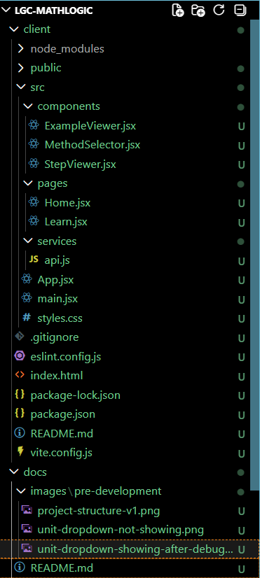
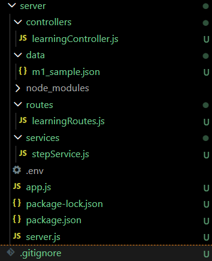
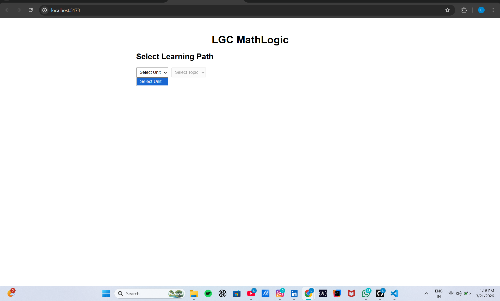
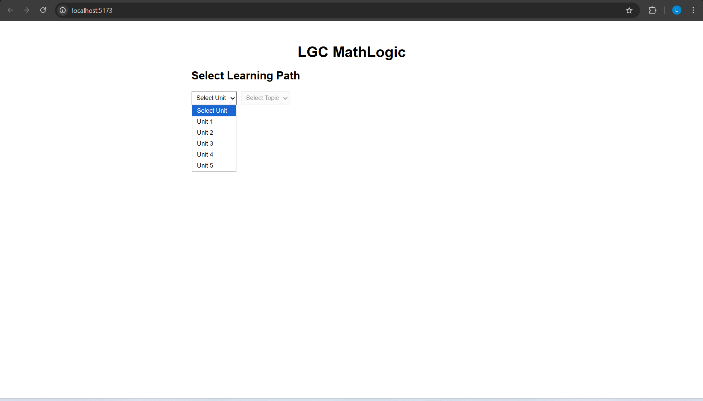

# 📘 LGC MathLogic — Development Documentation

This folder documents the development journey of **LGC MathLogic**, including system structure, debugging, and early UI behavior.

---

## 🧠 Purpose

- Track development progress  
- Capture debugging insights  
- Preserve architectural decisions  
- Provide visual proof of evolution  

---

## 📂 Pre-Development Phase

This phase includes:

> Initial setup, folder structuring, and debugging issues.

---

## 🧱 Project Structure

### 🔹 Client Structure (Frontend)



- React + Vite setup  
- Organized into:
  - `components/`
  - `pages/`
  - `services/`  
- Clean separation of UI and logic  

---

### 🔹 Server Structure (Backend)



- Express-based backend  
- Layered architecture:
  - `routes/`
  - `controllers/`
  - `services/`
  - `data/`  
- Designed for scalable knowledge system  

---

## ⚠️ Debugging Phase

### 🔹 Issue: Unit Dropdown Not Showing



**Problem:**
- Unit dropdown appeared empty  

**Root Cause:**
- Backend not reachable  
- `.env` misconfiguration (`PORT=500;`)  
- Port mismatch  

---

### 🔹 Fix: After Debugging



**Solution:**

```
PORT=5000
```

- Restarted backend  
- Verified API endpoint  

**Result:**
- Units loaded successfully  
- Frontend-backend communication established  

---

## 🔍 Key Learnings

- Small config errors can break systems  
- Always verify backend independently  
- Debug step-by-step  
- Clean structure reduces confusion  

---

## 🚀 Next Steps

- Expand Knowledge Base (M1 syllabus)  
- Improve step logic  
- Enhance UI clarity  
- Add method-level selection  

---

## 👤 Author

**Ramalingam Jayavelu**  
LGC Systems